# contenox/runtime: GenAI Orchestration Runtime


**contenox/runtime** is an open-source runtime for orchestrating generative AI workflows. It treats AI workflows as state machines, enabling:

✅ **Declarative workflow definition**
✅ **Built-in state management**
✅ **Vendor-agnostic execution**
✅ **Multi-backend orchestration**
✅ **Observability with passion**
✅ **Made with Go for intensive load**
✅ **Build agentic capabilities via hooks**
✅ **Drop-in for OpenAI chatcompletion API**
✅ **JavaScript function execution with event-driven triggers**

-----

## ⚡ Get Started in 1-3 Minutes

This single command will start all necessary services, configure the backend, and download the initial models.

### Prerequisites

  * Docker and Docker Compose
  * `curl` and `jq`

### Run the Bootstrap Script

```bash
# Clone the repository
git clone https://github.com/contenox/runtime.git
cd runtime

# Configure the systems fallback models
export EMBED_MODEL=nomic-embed-text:latest
export EMBED_PROVIDER=ollama
export EMBED_MODEL_CONTEXT_LENGTH=2048
export TASK_MODEL=phi3:3.8b
export TASK_MODEL_CONTEXT_LENGTH=2048
export TASK_PROVIDER=ollama
export CHAT_MODEL=phi3:3.8b
export CHAT_MODEL_CONTEXT_LENGTH=2048
export CHAT_PROVIDER=ollama
export OLLAMA_BACKEND_URL="http://ollama:11434"
# or any other like: export OLLAMA_BACKEND_URL="http://host.docker.internal:11434"
# to use OLLAMA_BACKEND_URL with host.docker.internal
# remember sudo systemctl edit ollama.service -> Environment="OLLAMA_HOST=172.17.0.1" or 0.0.0.0

# Start the container services
echo "Starting services with 'docker compose up -d'..."
docker compose up -d
echo "Services are starting up."

# Configure the runtime with the preferenced models
# the bootstraping script works only for ollama models/backends
# for to use other providers refer to the API-Spec.
./scripts/bootstrap.sh $EMBED_MODEL $TASK_MODEL $CHAT_MODEL
# setup a demo OpenAI chat-completion and model endpoint
./scripts/openai-demo.sh $CHAT_MODEL demo
# this will setup the following endpoints:
# - http://localhost:8081/openai/demo/v1/chat/completions
# - http://localhost:8081/openai/demo/v1/models
#
# example:
# docker run -d -p 3000:8080 \
# -e OPENAI_API_BASE_URL='http://host.docker.internal:8081/openai/demo/v1' \
# -e OPENAI_API_KEY='any-key-for-demo-env' \
# --add-host=host.docker.internal:host-gateway \
# -v open-webui:/app/backend/data \
# --name open-webui \
# --restart always \
# ghcr.io/open-webui/open-webui:main
```

Once the script finishes, the environment is fully configured and ready to use.

-----

### Try It Out: Execute a Prompt

After the bootstrap is complete, test the setup by executing a simple prompt:

```bash
curl -X POST http://localhost:8081/execute \
  -H "Content-Type: application/json" \
  -d '{"prompt": "Explain quantum computing in simple terms"}'
```

### Next Steps: Create a Workflow

Save the following as `qa.json`:

```json
{
  "input": "What's the best way to optimize database queries?",
  "inputType": "string",
  "chain": {
    "id": "smart-query-assistant",
    "description": "Handles technical questions",
    "tasks": [
      {
        "id": "generate_response",
        "description": "Generate final answer",
        "handler": "raw_string",
        "systemInstruction": "You're a senior engineer. Provide concise, professional answers to technical questions.",
        "transition": {
          "branches": [
            { "operator": "default", "goto": "end" }
          ]
        }
      }
    ]
  }
}
```

Execute the workflow:

```bash
curl -X POST http://localhost:8081/tasks \
  -H "Content-Type: application/json" \
  -d @qa.json
```

All runtime activity is captured in structured logs:

```bash
docker logs contenox-runtime-kernel
```

-----

## ✨ Key Features

### State Machine Engine

  * **Conditional Branching**: Route execution based on LLM outputs
  * **Agentic Capabilities**: Create autonomous agents and LLM-Call Loops to plan and execute actions using external tools.
  * **Built-in Handlers**:
      * `condition_key`: Validate and route responses
      * `parse_number`: Extract numerical values
      * `parse_range`: Handle score ranges
      * `raw_string`: Standard text generation
      * `embedding`: Embedding generation
      * `model_execution`: Model execution on a chat history
      * `hook`: Calls a user-defined hook pointing to an external service
  * **Context Preservation**: Automatic input/output passing between states
  * **Data Composition**: Merge and manipulate data between states, enabling sophisticated data pipelines.
  * **Multi-Model Support**: Define preferred models for each task chain
  * **Retry and Timeout**: Configure task-level retries and timeouts for robust workflows

### JavaScript Function Execution

```mermaid
sequenceDiagram
    participant Webhook
    participant EventBridge
    participant EventSource
    participant FunctionHandler
    participant GojaVM

    Webhook->>EventBridge: POST /ingest?path=github.webhook
    EventBridge->>EventSource: AppendRawEvent()
    EventBridge->>EventBridge: Apply mapping → domain event
    EventBridge->>EventSource: AppendEvent(user.created)
    EventSource->>FunctionHandler: HandleEvent(user.created)
    FunctionHandler->>GojaVM: Execute JS function "send_welcome_email"
    GojaVM->>EventSource: sendEvent(email.sent, {to: "alice@..."})
    GojaVM-->>FunctionHandler: Success
```



Execute custom JavaScript functions in response to events with a secure, sandboxed environment:

```javascript
function processOrder(event) {
  // Access event data
  const orderData = event.data;

  // Send new events via internal event bus
  const result = sendEvent("order.processed", {
    orderId: orderData.id,
    status: "processed",
    processedAt: new Date().toISOString()
  });

  return {
    success: result.success,
    eventId: result.event_id
  };
}
```

  * **Event-Driven Triggers**: Execute functions automatically when specific events occur
  * **Built-in Runtime Functions**: Access to `sendEvent`, `executeTask`, `callTaskChain`, and `executeTaskChain` from JavaScript
  * **Secure Sandbox**: Isolated execution environment with timeout and memory limits
  * **Pre-compiled Caching**: Functions are compiled and cached for optimal performance
  * **Error Handling**: Comprehensive error reporting and recovery mechanisms

### Multi-Provider Support

Define preferred model provider and backend resolution policy directly within task chains. This allows for seamless, dynamic orchestration across various LLM providers.

#### Architecture Overview


  * **Unified Interface**: Consistent API across providers
  * **Automatic Sync**: Models stay consistent across backends
  * **Affinity Group Management**: Map models to backends for performance tiering and routing strategies
  * **Backend Resolver**: Distribute requests to backends based on resolution policies

-----

#### 🧩 Extensibility with Hooks

Hooks are the bridge between AI workflows and any external system. They allow agents to fetch real-time information and perform meaningful actions. The runtime can connect to any external server that exposes its capabilities via a standard OpenAPI v3 schema.

  * **Automatic Tool Discovery**: Simply register a remote hook with its OpenAPI endpoint (`/openapi.json`). The runtime will automatically parse the schema and make every valid API operation available as a callable tool for the LLMs.
  * **Secure Credential Injection**: Securely manage API keys, tokens, and other configuration. Configure hooks to automatically inject headers (`Authorization: Bearer ...`) or other properties into every API call, keeping them hidden from the LLM and the workflow definition.
  * **Scoping & Controlling**: Control what Tools are available to the LLMs in which state and branch of the task-chain.

#### contenox-vibe (CLI for local chains)

**contenox-vibe** is a local CLI that runs the same task-chain engine without the full stack (no Postgres, NATS, or tokenizer). It uses SQLite and a local Ollama instance. Chains can use hooks (e.g. **local_exec**, **js_sandbox**, **ssh**) and macros (e.g. `{{hookservice:list}}`, `{{var:model}}`) so the model sees which tools are available and can script actions—run shell commands, execute JS that calls other models, etc. Use it for development, testing chains, or admin-style automation on a single machine. See [docs/contenox-vibe.md](docs/contenox-vibe.md) for a brief overview.

  * **Build & run**: `make run-vibe` (or `make build-vibe` then `./bin/contenox-vibe`). Requires a chain file and input, e.g. `make run-vibe ARGS="-chain .contenox/default-chain.json -input 'Hello'"`.
  * **Requirements**: Ollama running (e.g. `ollama serve`) and a model pulled (e.g. `ollama pull phi3:3.8b`). Chains live under `.contenox/`; optional `.contenox/config.yaml` supplies defaults (see below).
  * **Output**: Default is quiet (no telemetry on stderr; only errors and the result block). Use `--tracing` for operation telemetry; use `--steps` to print execution steps after the result.

#### Local exec hook (contenox-vibe)

The **local_exec** hook runs commands on the same host as the process (real side effects: execute a binary or script, optional stdin/env). It is available only when using **contenox-vibe** and is **opt-in** for security.

  * **Enable**: Pass `-enable-local-exec` when starting contenox-vibe. Without this flag, the hook is not registered.
  * **Sensitive default**: When local_exec is enabled, you **must** set an allow list; otherwise no commands run. Set at least one of `local_exec_allowed_commands` or `local_exec_allowed_dir` in `.contenox/config.yaml` (or via `-local-exec-allowed-*` flags) for any command to be allowed.
  * **Security**: Use only in trusted environments. Policy is config-first; flags override config.
    * **Allow list** (required for any execution): `local_exec_allowed_dir` (only run scripts/binaries under this directory) and/or `local_exec_allowed_commands` (comma-separated list or YAML list of allowed executable paths or names). At least one must be set when local_exec is enabled.
    * **Deny list** (optional): `local_exec_denied_commands` (YAML list or comma-separated via flag) — executable basenames or paths that are never allowed, even if they appear in the allow list. Checked first. Example: `[rm, dd, mkfs, curl, wget]`.
  * **Behaviour**: Input is passed as stdin. Args: `command` (required), `args` (optional), `cwd`, `timeout` (e.g. `30s`), `shell` (default `false`; set `true` to run via `/bin/sh -c`). Result is JSON: `exit_code`, `stdout`, `stderr`, `success`, `error`, `duration_seconds`.

Example chain task using the local_exec hook:

```json
{
  "id": "run_echo",
  "handler": "hook",
  "hook": {
    "name": "local_exec",
    "args": {
      "command": "/usr/bin/echo",
      "args": "hello"
    }
  },
  "transition": { "branches": [{ "operator": "default", "goto": "end" }] }
}
```

Run with: `./contenox-vibe -chain chain.json -enable-local-exec` (and other flags as needed).

#### Vibes chain (contenox-vibe)

The **vibes** chain turns natural language into command execution: you send a single message (e.g. "list files in /tmp" or "what's in my home directory?"), and the model uses the **local_exec** tool to run the right commands (e.g. `ls`), then replies in natural language. It requires **local_exec** to be enabled (`-enable-local-exec` or `enable_local_exec: true` in config) and an **Ollama model that supports tools** (e.g. `qwen2.5:7b`, `llama3.1:8b`). Models like `phi3:3.8b` do not support tool calling. Pull a tool-capable model first, e.g. `ollama pull qwen2.5:7b`. The chain defaults to `qwen2.5:7b`; if that is not your default `model`, add it under `extra_models` in `.contenox/config.yaml` with `name` and `context` so the runtime can resolve it.

Example:

```bash
make run-vibe ARGS="-chain .contenox/chain-vibes.json -input 'list files in /tmp' -enable-local-exec"
```

Or with the binary: `./contenox-vibe -chain .contenox/chain-vibes.json -input 'list files in /tmp' -enable-local-exec`. The `-input` string is treated as a single user message; the chain loops chat_completion and execute_tool_calls until the model responds without tool calls.

#### Default config and chain (contenox-vibe)

You can omit `-chain` and other flags by using a **default config** and/or a **default chain** under `.contenox/`.

  * **Config lookup**: The CLI looks for `.contenox/config.yaml` in the current directory, then in `~/.contenox/config.yaml`. The first file found is loaded. All keys are optional; flags override config when provided.
  * **Chains inside .contenox**: Chain paths from config are **relative to the .contenox directory** where the config was found. Chains must live inside `.contenox/` (e.g. `.contenox/default-chain.json` or `.contenox/chains/my-chain.json`) so they are always found regardless of where you run the command.
  * **Default chain**: If `-chain` is not set, the CLI uses `default_chain` from config (path relative to `.contenox/`), or the file `.contenox/default-chain.json` if it exists. If neither is set, the CLI exits with a short message.
  * **Config keys** (all optional): `default_chain`, `db`, `ollama`, `model`, `context`, `no_delete_models`, `enable_local_exec`, `local_exec_allowed_dir`, `local_exec_allowed_commands`, `local_exec_denied_commands`, `extra_models`, `tracing`, `steps`, `raw`, `template_vars_from_env` (vibe-only: env var names to expose as `{{var:name}}` in chains).
  * **Extra models**: Chains that use a model other than the default (e.g. the vibes chain with `qwen2.5:7b`) must declare that model so the runtime knows its context and capabilities. Add it under `extra_models` with at least `name` and `context`; optional `can_chat`, `can_prompt`, `can_embed` (defaults: chat and prompt true, embed false).

Example `.contenox/config.yaml`:

```yaml
default_chain: default-chain.json
ollama: http://127.0.0.1:11434
model: phi3:3.8b
enable_local_exec: false
# When enable_local_exec is true, you must set an allow list (no command runs without it):
# local_exec_allowed_commands: "ls,pwd,cat,head,tail,date"
# Optional deny list (block these even if allowed): local_exec_denied_commands: [rm, dd, mkfs, curl, wget]
# Optional: register extra models (e.g. for vibes chain)
extra_models:
  - name: qwen2.5:7b
    context: 32768
```

Then you can run: `./contenox-vibe -input "Say hello"` without passing `-chain` (and other options come from config).

-----

> for further information contact: **hello@contenox.com**
