# contenox/runtime: GenAI Orchestration Runtime


**contenox/runtime** is an open-source runtime for orchestrating generative AI workflows. It treats AI workflows as state machines, enabling:

✅ **Declarative workflow definition**
✅ **Built-in state management**
✅ **Vendor-agnostic execution**
✅ **Multi-backend orchestration**
✅ **Observability with passion**
✅ **Made with Go for intensive load**
✅ **Build agentic capabilities via hooks**
✅ **Drop-in for OpenAI chatcompletion API**
✅ **JavaScript function execution with event-driven triggers**

-----

## ⚡ Get Started in 1-3 Minutes

This single command will start all necessary services, configure the backend, and download the initial models.

### Prerequisites

  * Docker and Docker Compose
  * `curl` and `jq`

### Run the Bootstrap Script

```bash
# Clone the repository
git clone https://github.com/contenox/runtime.git
cd runtime

# Configure the systems fallback models
export EMBED_MODEL=nomic-embed-text:latest
export EMBED_PROVIDER=ollama
export EMBED_MODEL_CONTEXT_LENGTH=2048
export TASK_MODEL=phi3:3.8b
export TASK_MODEL_CONTEXT_LENGTH=2048
export TASK_PROVIDER=ollama
export CHAT_MODEL=phi3:3.8b
export CHAT_MODEL_CONTEXT_LENGTH=2048
export CHAT_PROVIDER=ollama
export OLLAMA_BACKEND_URL="http://ollama:11434"
# or any other like: export OLLAMA_BACKEND_URL="http://host.docker.internal:11434"
# to use OLLAMA_BACKEND_URL with host.docker.internal
# remember sudo systemctl edit ollama.service -> Environment="OLLAMA_HOST=172.17.0.1" or 0.0.0.0

# Start the container services
echo "Starting services with 'docker compose up -d'..."
docker compose up -d
echo "Services are starting up."

# Configure the runtime with the preferenced models
# the bootstraping script works only for ollama models/backends
# for to use other providers refer to the API-Spec.
./scripts/bootstrap.sh $EMBED_MODEL $TASK_MODEL $CHAT_MODEL
# setup a demo OpenAI chat-completion and model endpoint
./scripts/openai-demo.sh $CHAT_MODEL demo
# this will setup the following endpoints:
# - http://localhost:8081/openai/demo/v1/chat/completions
# - http://localhost:8081/openai/demo/v1/models
#
# example:
# docker run -d -p 3000:8080 \
# -e OPENAI_API_BASE_URL='http://host.docker.internal:8081/openai/demo/v1' \
# -e OPENAI_API_KEY='any-key-for-demo-env' \
# --add-host=host.docker.internal:host-gateway \
# -v open-webui:/app/backend/data \
# --name open-webui \
# --restart always \
# ghcr.io/open-webui/open-webui:main
```

Once the script finishes, the environment is fully configured and ready to use.

-----

### Try It Out: Execute a Prompt

After the bootstrap is complete, test the setup by executing a simple prompt:

```bash
curl -X POST http://localhost:8081/execute \
  -H "Content-Type: application/json" \
  -d '{"prompt": "Explain quantum computing in simple terms"}'
```

### Next Steps: Create a Workflow

Save the following as `qa.json`:

```json
{
  "input": "What's the best way to optimize database queries?",
  "inputType": "string",
  "chain": {
    "id": "smart-query-assistant",
    "description": "Handles technical questions",
    "tasks": [
      {
        "id": "generate_response",
        "description": "Generate final answer",
        "handler": "raw_string",
        "systemInstruction": "You're a senior engineer. Provide concise, professional answers to technical questions.",
        "transition": {
          "branches": [
            { "operator": "default", "goto": "end" }
          ]
        }
      }
    ]
  }
}
```

Execute the workflow:

```bash
curl -X POST http://localhost:8081/tasks \
  -H "Content-Type: application/json" \
  -d @qa.json
```

All runtime activity is captured in structured logs:

```bash
docker logs contenox-runtime-kernel
```

-----

## ✨ Key Features

### State Machine Engine

  * **Conditional Branching**: Route execution based on LLM outputs
  * **Agentic Capabilities**: Create autonomous agents and LLM-Call Loops to plan and execute actions using external tools.
  * **Built-in Handlers**:
      * `condition_key`: Validate and route responses
      * `parse_number`: Extract numerical values
      * `parse_range`: Handle score ranges
      * `raw_string`: Standard text generation
      * `embedding`: Embedding generation
      * `model_execution`: Model execution on a chat history
      * `hook`: Calls a user-defined hook pointing to an external service
  * **Context Preservation**: Automatic input/output passing between states
  * **Data Composition**: Merge and manipulate data between states, enabling sophisticated data pipelines.
  * **Multi-Model Support**: Define preferred models for each task chain
  * **Retry and Timeout**: Configure task-level retries and timeouts for robust workflows

### JavaScript Function Execution

```mermaid
sequenceDiagram
    participant Webhook
    participant EventBridge
    participant EventSource
    participant FunctionHandler
    participant GojaVM

    Webhook->>EventBridge: POST /ingest?path=github.webhook
    EventBridge->>EventSource: AppendRawEvent()
    EventBridge->>EventBridge: Apply mapping → domain event
    EventBridge->>EventSource: AppendEvent(user.created)
    EventSource->>FunctionHandler: HandleEvent(user.created)
    FunctionHandler->>GojaVM: Execute JS function "send_welcome_email"
    GojaVM->>EventSource: sendEvent(email.sent, {to: "alice@..."})
    GojaVM-->>FunctionHandler: Success
```



Execute custom JavaScript functions in response to events with a secure, sandboxed environment:

```javascript
function processOrder(event) {
  // Access event data
  const orderData = event.data;

  // Send new events via internal event bus
  const result = sendEvent("order.processed", {
    orderId: orderData.id,
    status: "processed",
    processedAt: new Date().toISOString()
  });

  return {
    success: result.success,
    eventId: result.event_id
  };
}
```

  * **Event-Driven Triggers**: Execute functions automatically when specific events occur
  * **Built-in Runtime Functions**: Access to `sendEvent`, `executeTask`, `callTaskChain`, and `executeTaskChain` from JavaScript
  * **Secure Sandbox**: Isolated execution environment with timeout and memory limits
  * **Pre-compiled Caching**: Functions are compiled and cached for optimal performance
  * **Error Handling**: Comprehensive error reporting and recovery mechanisms

### Multi-Provider Support

Define preferred model provider and backend resolution policy directly within task chains. This allows for seamless, dynamic orchestration across various LLM providers.

#### Architecture Overview


  * **Unified Interface**: Consistent API across providers
  * **Automatic Sync**: Models stay consistent across backends
  * **Affinity Group Management**: Map models to backends for performance tiering and routing strategies
  * **Backend Resolver**: Distribute requests to backends based on resolution policies

-----

#### 🧩 Extensibility with Hooks

Hooks are the bridge between AI workflows and any external system. They allow agents to fetch real-time information and perform meaningful actions. The runtime can connect to any external server that exposes its capabilities via a standard OpenAPI v3 schema.

  * **Automatic Tool Discovery**: Simply register a remote hook with its OpenAPI endpoint (`/openapi.json`). The runtime will automatically parse the schema and make every valid API operation available as a callable tool for the LLMs.
  * **Secure Credential Injection**: Securely manage API keys, tokens, and other configuration. Configure hooks to automatically inject headers (`Authorization: Bearer ...`) or other properties into every API call, keeping them hidden from the LLM and the workflow definition.
  * **Scoping & Controlling**: Control what Tools are available to the LLMs in which state and branch of the task-chain.

[🔗 **Deep Dive: See the Advanced Hooks Guide**](./docs/hooks.md)

-----

## 📘 API Documentation

The full API surface is thoroughly documented and defined in the OpenAPI format, making it easy to integrate with other tools. More details here:

  * 🔗 [API Reference Documentation](./docs/api-reference.md)
  * 🔗 [View OpenAPI Spec (YAML)](./docs/openapi.yaml)

The [API-Tests](./apitests) are available for additional context.
```

> for further information contact: **hello@contenox.com**
