Treat AI workflows as state machines with:

- Declarative workflow definition, state management, vendor-agnostic execution
- Multi-backend orchestration, observability, agentic capabilities via hooks
- Drop-in for OpenAI chatcompletion API; JavaScript function execution with event-driven triggers


## ✨ Key Features

### State Machine Engine

  * **Conditional Branching**: Route execution based on LLM outputs
  * **Agentic Capabilities**: Create autonomous agents and LLM-Call Loops to plan and execute actions using external tools.
  * **Built-in Handlers**:
      * `condition_key`: Validate and route responses
      * `parse_number`: Extract numerical values
      * `parse_range`: Handle score ranges
      * `raw_string`: Standard text generation
      * `embedding`: Embedding generation
      * `model_execution`: Model execution on a chat history
      * `hook`: Calls a user-defined hook pointing to an external service
  * **Context Preservation**: Automatic input/output passing between states
  * **Data Composition**: Merge and manipulate data between states, enabling sophisticated data pipelines.
  * **Multi-Model Support**: Define preferred models for each task chain
  * **Retry and Timeout**: Configure task-level retries and timeouts for robust workflows

### JavaScript Function Execution

```mermaid
sequenceDiagram
    participant Webhook
    participant EventBridge
    participant EventSource
    participant FunctionHandler
    participant GojaVM

    Webhook->>EventBridge: POST /ingest?path=github.webhook
    EventBridge->>EventSource: AppendRawEvent()
    EventBridge->>EventBridge: Apply mapping → domain event
    EventBridge->>EventSource: AppendEvent(user.created)
    EventSource->>FunctionHandler: HandleEvent(user.created)
    FunctionHandler->>GojaVM: Execute JS function "send_welcome_email"
    GojaVM->>EventSource: sendEvent(email.sent, {to: "alice@..."})
    GojaVM-->>FunctionHandler: Success
```



Execute custom JavaScript functions in response to events with a secure, sandboxed environment:

```javascript
function processOrder(event) {
  // Access event data
  const orderData = event.data;

  // Send new events via internal event bus
  const result = sendEvent("order.processed", {
    orderId: orderData.id,
    status: "processed",
    processedAt: new Date().toISOString()
  });

  return {
    success: result.success,
    eventId: result.event_id
  };
}
```

  * **Event-Driven Triggers**: Execute functions automatically when specific events occur
  * **Built-in Runtime Functions**: Access to `sendEvent`, `executeTask`, `callTaskChain`, and `executeTaskChain` from JavaScript
  * **Secure Sandbox**: Isolated execution environment with timeout and memory limits
  * **Pre-compiled Caching**: Functions are compiled and cached for optimal performance
  * **Error Handling**: Comprehensive error reporting and recovery mechanisms

### Multi-Provider Support

Define preferred model provider and backend resolution policy directly within task chains. This allows for seamless, dynamic orchestration across various LLM providers.

#### Architecture Overview


  * **Unified Interface**: Consistent API across providers
  * **Automatic Sync**: Models stay consistent across backends
  * **Affinity Group Management**: Map models to backends for performance tiering and routing strategies
  * **Backend Resolver**: Distribute requests to backends based on resolution policies

-----

#### 🧩 Extensibility with Hooks

Hooks are the bridge between AI workflows and any external system. They allow agents to fetch real-time information and perform meaningful actions. The runtime can connect to any external server that exposes its capabilities via a standard OpenAPI v3 schema.

  * **Automatic Tool Discovery**: Simply register a remote hook with its OpenAPI endpoint (`/openapi.json`). The runtime will automatically parse the schema and make every valid API operation available as a callable tool for the LLMs.
  * **Secure Credential Injection**: Securely manage API keys, tokens, and other configuration. Configure hooks to automatically inject headers (`Authorization: Bearer ...`) or other properties into every API call, keeping them hidden from the LLM and the workflow definition.
  * **Scoping & Controlling**: Control what Tools are available to the LLMs in which state and branch of the task-chain.

-----

#### 🖥️ Local CLI (`vibe`)

The same task engine runs as a local CLI (`vibe`) with two built-in hooks that give the model direct access to your machine:

| Hook | What the model can do |
|------|-----------------------|
| `local_shell` | Run bash commands (`ls`, `cat`, `grep`, `chmod`, custom scripts…) |
| `local_fs` | Read, write, and search files on disk |

**Interactive mode** — Natural language input, model uses tools and replies in text:
```bash
vibe "find all TODO comments in the Go files and list them"
```

**Autonomous planning** — Break a goal into steps, execute with human review between each:
```bash
vibe plan new "migrate all TODOs in the codebase to TODOS.md"
vibe plan next          # one step at a time
vibe plan next --auto   # run to completion
```

**Stateless pipeline** — Run any chain with explicit input type control:
```bash
cat diff.txt | vibe exec --chain .contenox/review-chain.json --input-type chat
```

See [docs/contenox-vibe.md](contenox-vibe.md) for full configuration and chain authoring reference.

